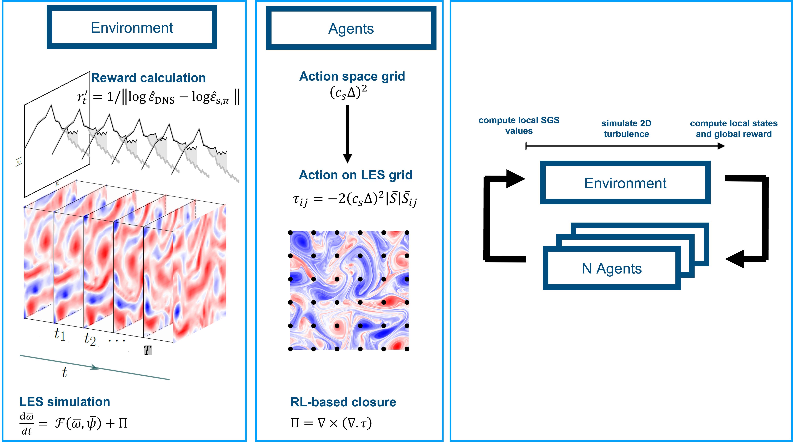

# Verbose Repo Template Name

#### [[project website]](https://github.com/rmojgani/)


## Table of contents
* [Introduction](#Introduction)
* [Requirements](#Requirements)
* [Experiments](#Experiments)
    * [Case 1](#Case-1)
* [Citation](#Citation)
* [References](#References)

## Introduction
<!-- An abstract length introduction 
	to the project -->
The checklist for refactor progress
- [] Check consistency with Py2D
  - [x] RHS
  - [x] FK
- [ ] Optional CPU-GPU backend
- [ ] Consistent model action ($`c_l^3`$ and $`c_s^2`$)
- [ ] Options to save a list of parameters ($`\omega`$, $`\psi`$, $`\nu_e`$, $`c_{model}`$, $`\Pi`$, action list)
- [ ] Re-organize the state model, maybe have it as a list of options (accumalative):
  - [ ] Global: energy spectra
  - [ ] Global: enstrophy spectra
  - [ ] local: $`\nabla u`$
  - [ ] local: $`\nabla \nabla u`$
- [ ] Update initial condition for cases (and the corresponding spectra)
  - [ ] Case 1: $`\kappa_f=4`$ , Re$`=20\times10^3`$, $`\beta=0`$
  - [ ] Case 2: $`\kappa_f=4`$ , Re$`=20\times10^3`$, $`\beta=0`$
  - [ ] Case 3: $`\kappa_f=25`$ , Re$`=20\times10^3`$, $`\beta=20`$
- [ ] Check consistency of IC mat files  with the solver
- [ ] Case management system: Copy config file in the folder
- [ ] bring options to sh file: 
  - [ ] ["Policy"]["Distribution"] choice 
- [ ] Double check the naming of time steps: n_init, ...  

## Requirements
<!-- These are examples,
	add or remove as appropriate -->

- python 3.6
	- [scipy](https://pypi.org/project/scipy/)
	- [numpy](https://pypi.org/project/numpy/)
- JAX


## Experiments
### Case 1
Case 1 is disscused here [Case 1 Location](./experiments/case1) 

To run the training
```
bash run.sh
```

To run post process
```
bash runpost.sh
```

To delete all data files in the folder
```
bash clean.sh
```

## Citation
- Mojgani, R., Waelchli, D., Guan, Y., Koumoutsakos, P., Hassanzadeh, P.  "Extreme Event Prediction with Multi-agent Reinforcement Learning-based Parametrization of Atmospheric and Oceanic Turbulence", arXiv: 2312.00907, 2023.([url](https://arxiv.org/abs/2312.00907))<details><summary>BibTeX</summary><pre>
@article{Mojgani_arxiv_2023,
      title={Extreme Event Prediction with Multi-agent Reinforcement Learning-based Parametrization of Atmospheric and Oceanic Turbulence}, 
      author={Rambod Mojgani and Daniel Waelchli and Yifei Guan and Petros Koumoutsakos and Pedram Hassanzadeh},
      year={2023},
      eprint={2312.00907},
      archivePrefix={arXiv},
}</pre></details>
